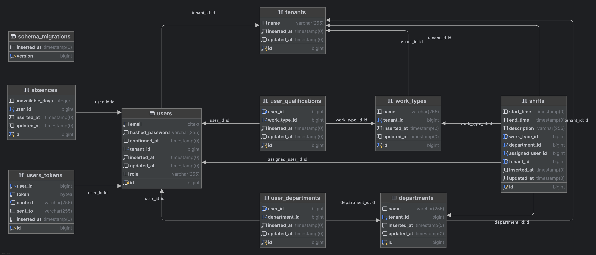

# RosterApp

RosterApp is a web application for work force management.

## Getting started

To start the application:

  * start the database 
```bash 
docker run --name roaster_app_dev -e POSTGRES_USER=postgres -e POSTGRES_PASSWORD=postgres -e POSTGRES_DB=roaster_app_dev -p 5432:5432 -d postgres
``` 
or if the container is already created:
```bash 
docker start roaster_app_dev
```

  * Run `mix setup` to install and setup dependencies
    * This generates the data in the seed for testing. 
    See [priv/repo/seeds.exs](priv/repo/seeds.exs) for the data generated with credentials for the different user roles.
  * Start the phoenix server with `mix phx.server` or inside IEx with `iex -S mix phx.server`

Now you can visit [`localhost:4000`](http://localhost:4000) from your browser.


## Implementation

I did learn LiveView while implementing this, and I was a little bit rustier with Elixir than I thought, 
so I didn't get to implement some important parts of the application. 
See [Opportunities for improvement](#opportunities-for-improvement) for all the features/requirements I left out due to time constraints.

I used ChatGPT to refine the requirements, create an implementation plan and start implementing the base of the application. 
See [Prompt Changelog](prompt_changelog.md).

When the logic started to get complex, I tried to use GitHub copilot in the hope that it would make better suggestions having
the context of the code. I found that it was not as useful as I expected, and I ended up implementing the logic myself with help 
both from Copilot for smaller questions and ChatGPT for larger questions.

The following list describes an overview of the design decisions. 
The [Database Schema](#database-schema) might help understanding the current design.

Design and implementation decisions:
- There is a tenant schema that is used to separate the data of different tenants supporting multi-tenancy.
- Absences are an array of days of the week.
- Shifts have timestamps with timezone but the timezone is not entered from the UI for simplicity reasons.
- Some UI/UX elements were left out and I did not put much time in the UX due to time constraints 

Here is a list of the features that were implemented:
- General UI
  - The menu items are on the top right: account settings, shifts, absences
  - The user details such as role, department and work type are shown in the `account settings`
  - Absence management is done under the `absences` menu item
  - Shift management is done under the `shifts` menu item
  - The users eligible to be assigned to a shift are calculated when the shift attributes are fully entered or modified
  - Shift assignment is done in the edit shift view
- User schema with authentication using the phoenix live view standard
- The following requirements were implemented in the backend. Not all of them have a UI:
  - Tenants
  - Users
  - Absences
  - Departments
  - Work types
  - Shifts
- Each user can add one absence to their profile by selecting specific days of the week. Absences are implemented as full days.
- Managers are able to create and assign shifts to either other managers or workers. 
- The assignment logic was implemented as follows:
  - The shift is only matched to the user when the shift department and work type match any of the user departments and work types.
  - The shift can be assigned to the user if the shift does not overlap with any user absence days nor any of the taken shifts.
- Shifts are sorted by unassigned shifts first and then by shift start date.
- Managers see shifts created for the whole tenant.
- Workers see shifts that are unassigned or assigned to them.
- Users are notified (PubSub) in the shifts view when a shift was deleted, edited or created and is assigned to them.
  


### Database Schema



### Opportunities for Improvement
- Add logger and logs to the application
- Shift management
  - Handle shift conflicts when modifying shifts or absences
  - Improve the shift UI/UX to see the shifts and absences better. Maybe a calendar view would fit this
  - Paginate by day, week, month
  - Ability to filter by different attributes
  - Better UX than using the basic edit to assign shifts to users
  - Handle concurrency in shift operations
- Improve absence management
  - Add the ability to add partial absences
  - Add the ability to add absences for a specific date range
- Account management
    - Create super-admin and admins roles being able to create tenants, departments, work types and users
    - Implement UI/UX departments, work types and users
- Better permissions management in the backend
    - Block specific operations on backend level depending on the user role
- Improve pub/sub notifications
  - Right now is only implemented in the shifts view
  - Only the shift assignment is implemented. Shift creation is missing
- Use the timezone in the frontend and work with it in the backend
- Make the UI/UX much better in general
- Load tests and possible optimizations
